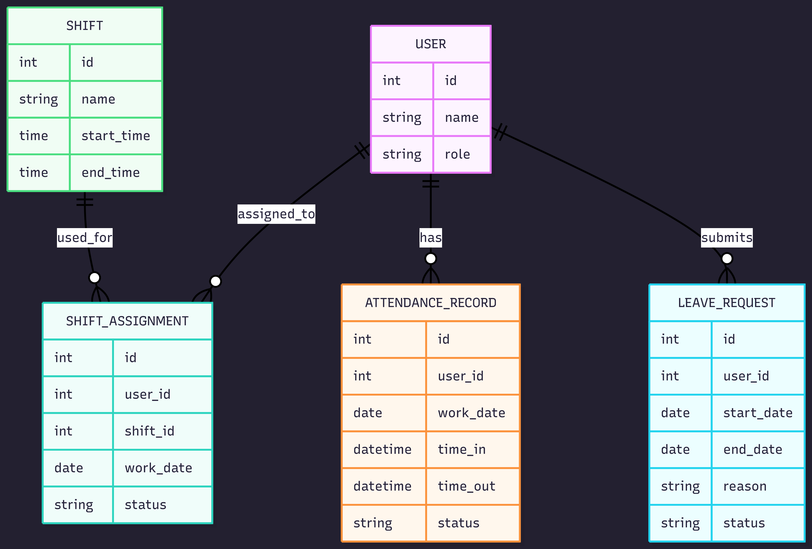

# StaffSync: Employee Schedule, Attendance, and Leave Management System

## 1. Problem Statement

Small organizations often manage employee schedules, attendance, and leave requests through spreadsheets or chat messages. This can lead to missed updates, overlapping schedules, unclear attendance records, and difficulty checking whether an employee is available to work. Employees need a clear way to view their schedules and request leave, while managers need a centralized system for assigning shifts and monitoring attendance. WorkTrack aims to organize employee scheduling, attendance tracking, and leave request management in one system.

## 2. Target Users & Roles

| Role | Can | Cannot |
|---|---|--- |
| Employee | View assigned shifts, submit leave requests, view own attendance records | Create schedules, approve leave, view other employees’ records |
| Manager | Assign shifts, approve/reject leave requests, view employee attendance records | Manage user accounts, manage shift templates |
| Administrator | Manage users, manage shift templates, access all records |  |

## 3. Domain Model

**Shift** is separte from **ShiftAssignment** because a shift acts as a reusable template, while a shift assignment connects a specific employee to a specific shift on a specific date. 

## 4. Non-Trivial Business Features

**Workforce Scheduling Validator**

When a manager assigns a shift to an employee, the system rejects the assignment if the employee already has an overlapping shift on the same date or if the employee has an approved leave request covering that date. The system also rejects assignments if the employee will exceed 40 scheduled hours in the same week

**Employee Availability Validator for Shift Assignment**

When a manager creates a shift assignment, the system only shows employees who are available for that shift. An employee is considered unavailable if they have an approved leave request that overlaps the shift date, already have another assigned shift that overlaps the same time period, or would exceed the weekly hour limit.

## 5. User Stories

**Employee**

1. As an employee, I can view my assigned shifts, so that I know when I am expected to work. Acceptance: Only my own upcoming shifts are displayed.
2. As an employee, I can submit a leave request, so that my manager can review my planned absence. Acceptance: The request is saved with a pending status.
3. As an employee, I can view the status of my leave requests, so that I know whether they were approved or rejected. Acceptance: Each leave request displays its current status.
4. As an employee, I can view my attendance records, so that I can check my time-in and time-out history. Acceptance: Only my own attendance records are displayed.

**Manager**

1. As a manager, I can assign shifts to employees, so that employee schedules are organized. Acceptance: The system rejects shift assignments that overlap existing shifts, conflict with approved leave requests, exceed weekly hour limits. Otherwise, the shift assignment is saved.
2. As a manager, I can view an employee’s schedule, so that I can check their availability before assigning work. Acceptance: The employee’s assigned shifts and approved leave dates are visible to the manager.
3. As a manager, I can approve or reject leave requests, so that employee absences are properly handled. Acceptance: Approved leave prevents the employee from being assigned shifts during the leave period. 
4. As a manager, I can view employees available for a selected shift, so that I can assign work efficiently. Acceptance: Employees with conflicting shifts, approved leave requests, or exceeded weekly hour limits do not appear in the available employee list.
5. As a manager, I can record or update attendance records, so that attendance history stays accurate. Acceptance: Attendance records include time-in, time-out, date, and status.

**Administrator**

1. As an administrator, I can create and edit user accounts, so that employees and managers can access the system. Acceptance: Each user account has a role that controls its permissions.
2. As an administrator, I can create and edit shift templates, so that managers can reuse standard work schedules. Acceptance: Shift templates can be selected when creating shift assignments.

## 6. Scope

**In Scope**

- User authentication and role-based access control
- Employee, Manager, and Administrator roles
- User account management
- Shift template management
- Shift assignment management
- Employee schedule viewing
- Leave request submission
- Leave request approval and rejection workflow
- Attendance record management
- Employee Availability Validator
- Available employee filtering during shift assignment
- Attendance status tracking (Present, Late, Absent, Incomplete)
- Basic dashboards for employees and managers

**Out of Scope**
- Payroll computation
- Biometric attendance integration
- Email/SMS notifications
- Performance evaluation
- Mobile app version
- Chat system
- Calendar sync

## 7. Deployment Target

The application will be deployed on Render using a managed PostgreSQL database.
